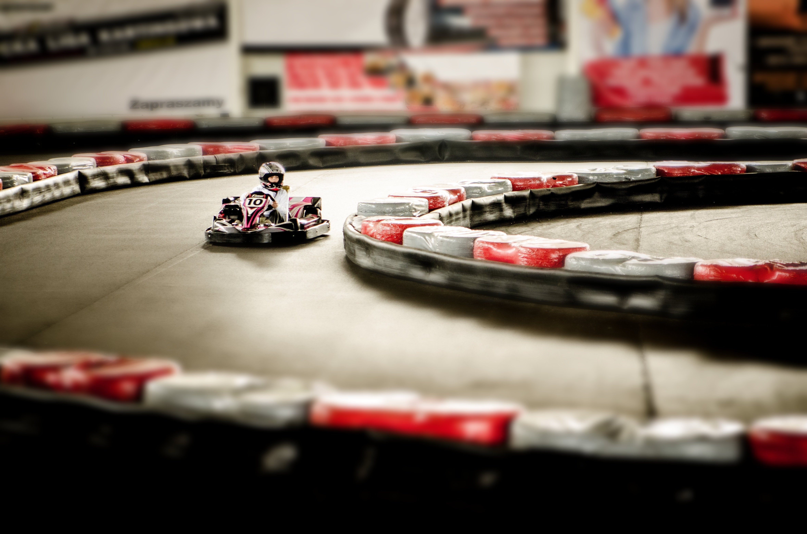
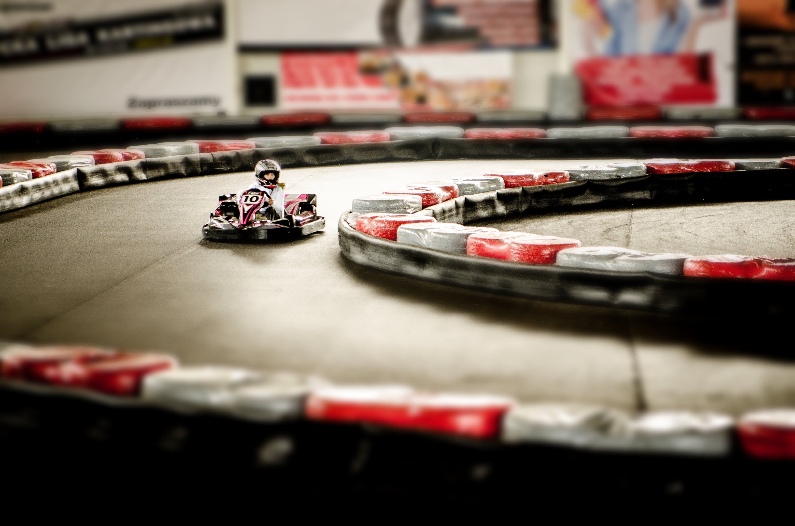

# Optimización de Imágenes

A continuación se documenta la optimización realizada sobre una imagen libre de derechos, comparando su peso y calidad antes y después del proceso.  
La versión optimizada será utilizada en producción.

---

## 📌 Imagen 

| Versión        | Peso     | Herramienta | Observaciones |
|----------------|----------|-------------|---------------|
| **Original**   | 1396 KB  | —           | Imagen nítida sin pérdida visible de calidad. |
| **Optimizada** | 753 KB   | iLoveIMG    | A simple vista mantiene buena calidad. Al ampliar más del 250 %, aparecen ligeras pixelaciones y mínima pérdida de nitidez, aunque  imperceptible en uso normal. |

---

### 🖼 Comparación

| Original | Optimizada |
|----------|-----------|
|  |  |

---

### 📊 Resultado

- **Peso original:** 1396 KB  
- **Peso optimizado:** 753 KB  
- **Reducción total:** ~46 %

✔ La imagen optimizada se considera apta para producción, ya que logra una reducción significativa del tamaño manteniendo una calidad visual aceptable.

---

